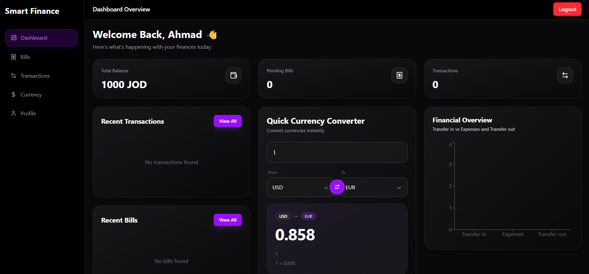
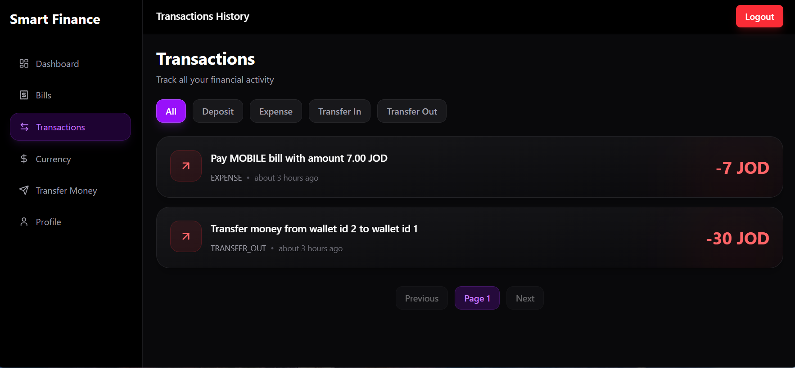
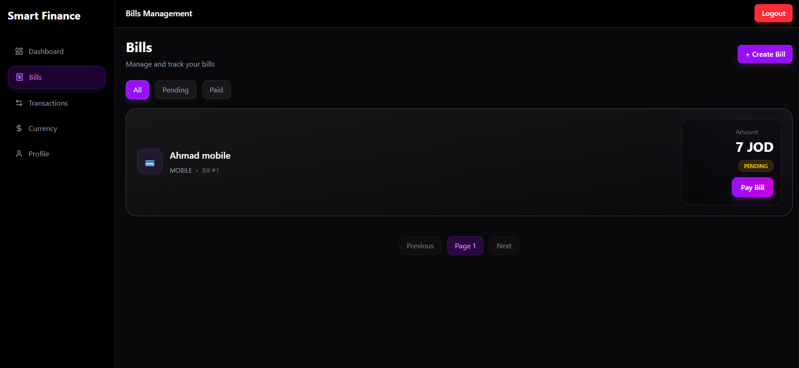
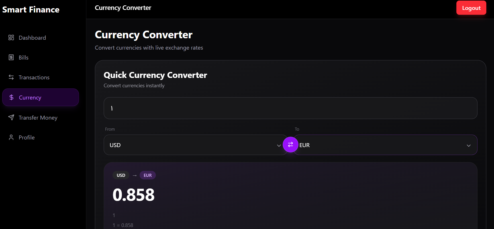
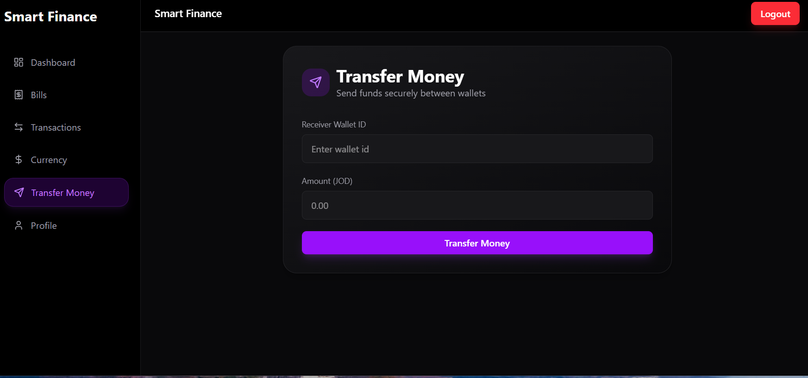
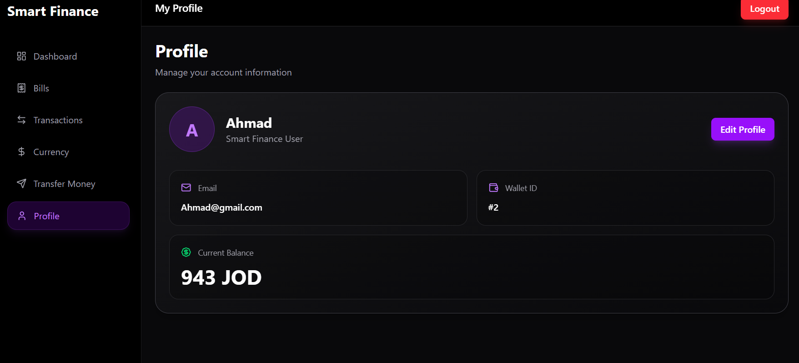

# Smart Finance Dashboard

A modern full-stack finance management platform built with Spring Boot, React, PostgreSQL, and Docker.

## Features

### Authentication & Security

- JWT Authentication
- Secure Login & Registration
- Protected Routes
- Spring Security Integration

### Wallet Management

- View Wallet Balance
- Deposit Tracking
- Transfer Money Between Wallets
- Balance Validation
- Prevent Self Transfers

### Transactions

- View Transaction History
- Filter Transactions
- Transfer In / Transfer Out Tracking
- Expense & Deposit Monitoring

### Bills Management

- Create Bills
- View Bills
- Pay Bills
- Track Bill Status (Pending / Paid)

### Dashboard

- Financial Overview
- Recent Transactions
- Recent Bills
- Financial Analytics Charts
- Currency Converter Widget

### Currency Exchange

- Real-time Currency Conversion
- Popular Currency Rates

---

# Screenshots

## Dashboard



---

## Transactions



---

## Bills



---

## Currency Converter



---

## Transfer Money



---

## Profile



---

## Tech Stack

### Backend

- Java 21
- Spring Boot 3
- Spring Security
- Spring Data JPA
- PostgreSQL
- JWT Authentication
- OpenFeign
- Swagger / OpenAPI
- JUnit
- Mockito

### Frontend

- React 19
- TypeScript
- Vite
- React Query
- Zustand
- React Hook Form
- Zod
- Tailwind CSS
- Axios
- Recharts

### DevOps

- Docker
- Docker Compose
- GitHub

---

## Project Structure

```text
smart-finance-dashboard
│
├── backend
│   └── demo
│
├── frontend
│
├── docs
│
└── README.md
```

---

## Running the Backend

```bash
cd backend/demo

mvn clean package

docker compose up --build
```

Backend:

```text
http://localhost:8082
```

Swagger UI:

```text
http://localhost:8082/swagger-ui/index.html
```

---

## Running the Frontend

```bash
cd frontend

npm install

npm run dev
```

Frontend:

```text
http://localhost:5173
```

---

## Docker Setup

### Backend

```bash
docker compose up --build
```

### Frontend

```bash
docker build -t smartfinance-frontend .

docker run -d -p 5173:80 smartfinance-frontend
```

---

## Testing

Backend Tests:

```bash
mvn test
```

---

## Future Improvements

- Email Notifications
- Scheduled Bill Reminders
- Budget Planning
- Multi-Wallet Support
- External Banking Integration
- User-to-User Wallet Search
- Transfer Confirmation Modal

---

## Author

### Ahmad Mueiqil

GitHub:

https://github.com/ahmadmueiqil
